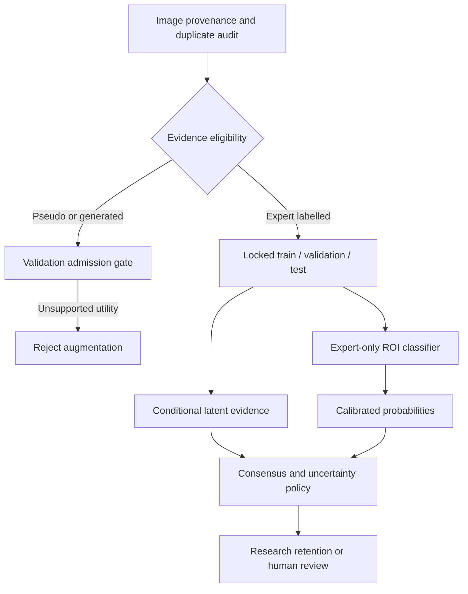

# Architecture and engineering decisions

## Research architecture

The diagram describes the study. The code released in this folder implements the policy at its end, plus an aggregate audit; it does not implement all upstream boxes.

## Portable policy contract

- Input: two calibrated four-class probability vectors, in order `AOM, ASOM, CSOM, Normal`.
- Reject malformed lengths, negative/nonfinite values and vectors whose sum differs from one beyond tolerance.
- ROI-only rule: maximum probability >= 0.70 and normalized entropy <= 0.65.
- Full rule: ROI-only conditions plus branch agreement, latent confidence >= 0.50 and latent normalized entropy <= 0.75.
- Output: class order, branch predictions, confidence, entropy, policy version, action and referral reasons.
- True labels never enter the gate. Class labels are used only in offline evaluation.
- Thresholds reproduce an exploratory study policy; they are not deployment-approved clinical thresholds.

## Design decisions

| Decision | Reason | Tradeoff |
|---|---|---|
| Keep expert-only ROI primary | Pseudo-label fusion lacked established incremental benefit | Fewer training inputs, cleaner evidence interpretation |
| Permit zero synthetic admissions | Generative output must demonstrate validation utility | No claim of synthetic-data performance gain |
| Report classwise outcomes with coverage | Aggregate retained accuracy can hide minority failures | More complex but more useful evaluation |
| Keep auxiliary taxonomy separate | Different cohorts and labels are not interchangeable | Avoid a misleading pooled headline |
| Separate audit from inference | Aggregates are available without restricted images or checkpoints | Audit can run publicly, full reproduction cannot yet |

## Planned platform integration

A future service would load versioned model artifacts, generate calibrated probabilities, invoke this policy and write an access-controlled audit event with model version, policy version and a pseudonymous request identifier. Human review would remain mandatory according to the approved clinical protocol. This service is a design proposal, not an implemented or hosted endpoint.

Before deployment: verify model artifacts and calibration provenance; test missing/invalid/OOD inputs; define retention and access policies; measure latency and resource costs; set drift alerts; conduct patient-grouped external evaluation with prespecified classwise requirements and a reviewed rollback process.

Related portfolio implementations: [OtoSage AWS](https://github.com/singhankitsrf/OtoSage_AWS_GitHub) and [OtoVision MLOps](https://github.com/singhankitsrf/Otovision-MLOps). Their infrastructure must not be interpreted as evidence that PG-GECR itself is deployed on AWS or Kubernetes.
